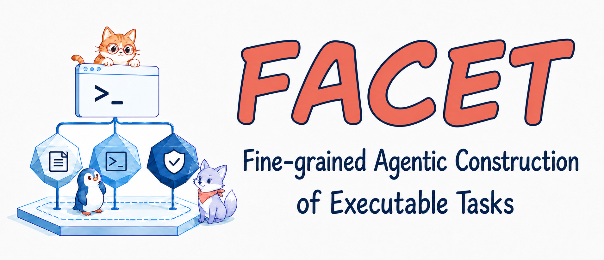
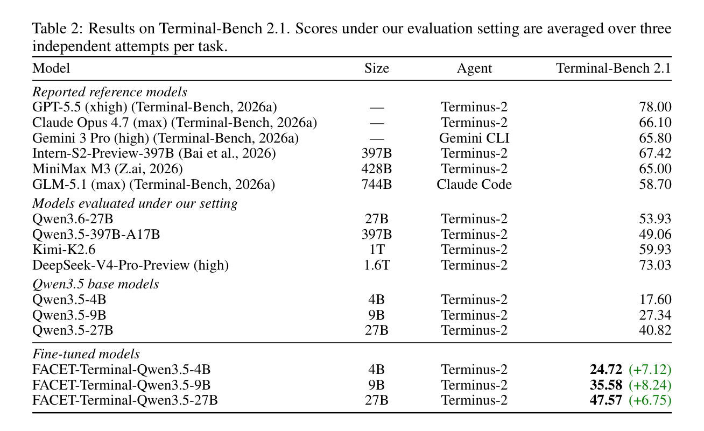

<div align="center">

[简体中文](README.md) | [English](README_EN.md)



<p>
  
  
  
  
</p>

[[🌐 Project Page](https://stokou.github.io/FACET-Terminal/)]
[[📖 Paper (Coming Soon)](#)]
[[🤗 Data (Coming Soon)](#)]
[[🤗 Models (Coming Soon)](#)]

</div>

---

# 🔥 News

- **`2026-08-19`**: Released the FACET-Terminal task-synthesis code preview and project page.
- **Coming Soon**: Paper, datasets, training configurations, and model checkpoints.

# 💡 FACET

**FACET** (Fine-grained Agentic Construction of Executable Tasks) synthesizes complex, coherent, and verifiable terminal tasks from related agent skills.

It is built around two principles:

- **Preserve source intent** across multi-stage generation, including capabilities, dependencies, I/O contracts, and procedural knowledge.
- **Share executable state** by realizing the environment first and grounding the instruction, solution, and verifier in the same container state.


# ✨ Highlights

- 🧩 **Scenario reconstruction** recovers goals, context, capability relations, intermediate states, and tool constraints.
- 🖥️ **Environment-first construction** realizes and validates the Docker environment before final task generation.
- 🔗 **State alignment** grounds the instruction, reference solution, and verifier in shared initial and final states.
- 🛠️ **Targeted repair** uses failure traces to update only the responsible task artifact.
- 🔬 **Three generation strategies** provide `FORWARD`, `REVERSE`, and `JOINT` for controlled comparisons.

# 📊 Results

Starting from **71,341** source skills, FACET constructs **7,852** scenario-skill seeds and produces **6,078** execution-validated tasks. We further select **1.2K** complete successful trajectories for supervised fine-tuning of the Qwen3.5 model family.

## Terminal-Bench 2.1

All models below use the `Terminus-2` agent. Base and FACET models are evaluated under the same inference configuration, with three independent attempts per task and the mean pass rate reported.

<div align="center">
  
</div>

Only 1.2K successful trajectories yield consistent gains across all three scales. The 9B model obtains the largest absolute gain, while the 4B model improves by **40.5%** relatively. FACET-Terminal-Qwen3.5-27B reaches **47.57**, only 1.49 points below Qwen3.5-397B at **49.06** under the same setting, despite being roughly 15 times smaller.

# 📦 Installation

## Requirements

- Python `3.11–3.13`
- [uv](https://docs.astral.sh/uv/)
- Docker for environment construction and executable validation

```bash
git clone https://github.com/StoKou/FACET-Terminal.git
cd FACET-Terminal/facet
uv sync
```

# 🚀 Quick Start

Public configs never store real credentials. Export the model key first:

```bash
export FACET_API_KEY="your-api-key"
```

All configurations, scripts, and Python sources live under `facet/`. From that directory, set your private `api_base`, `model_name`, and input JSONL path in `configs/FORWARD.yaml`, then run:

```bash
uv run python facet_terminal/pipeline.py \
  --config configs/FORWARD.yaml \
  --strategy FORWARD
```

Run one stage:

```bash
uv run python facet_terminal/pipeline.py \
  --config configs/FORWARD.yaml \
  --strategy FORWARD \
  --stage planning
```

Experimental strategies:

```bash
uv run python facet_terminal/pipeline.py --config configs/REVERSE.yaml --strategy REVERSE
uv run python facet_terminal/pipeline.py --config configs/JOINT.yaml --strategy JOINT
```

# 📄 Input Format

The default adapter expects one skill pair per JSONL record:

```json
{
  "pair_id": "pair_demo",
  "skill_ids": ["skill_a", "skill_b"],
  "skill_summaries": ["summary a", "summary b"],
  "scenario_texts": ["initial context", "desired outcome"],
  "quality": {"overall_status": "ACCEPTED"}
}
```

`skill_objects_jsonl` and `mapped_jsonl` adapters are also included for object-based and arbitrarily nested inputs.

# 🗂️ Repository Layout

```text
FACET-Terminal/
├── README.md               # Default Chinese project documentation
├── README_EN.md            # English project documentation
├── asset/                  # README-only images
├── docs/                   # Static GitHub Pages site and its own assets
└── facet/                  # All open-source code, configs, and scripts
    ├── common/             # Config, IO, hashing, model client, and run context
    ├── configs/            # Sanitized configs for three generation strategies
    ├── facet_terminal/
    │   ├── stages/         # Scenario, environment, generation, validation, and repair
    │   ├── harbor-template/ # Harbor task template
    │   ├── pipeline.py     # CLI entrypoint and stage routing
    │   └── prompts*.py     # Default and experimental prompts
    ├── scripts/            # Auxiliary-script notes and extension entrypoints
    ├── tests/              # Unit tests
    ├── .env.example        # Environment-variable template
    ├── pyproject.toml      # Python project and dependency configuration
    └── uv.lock             # Reproducible dependency lockfile
```

# 🔒 Release and Safety Notes

- Source datasets, generated tasks, trajectories, model weights, and runtime outputs are not included.
- API keys are read from `FACET_API_KEY`; `facet/.env*`, `facet/configs/local/`, and runtime directories under `facet/` are ignored.
- The pipeline builds and executes generated Docker tasks. Run it on an isolated development machine or sandbox, not on a production host that contains sensitive data.

# 🧪 Tests

```bash
cd facet
uv run pytest
```

# ✉️ Contact

Questions and feedback are welcome:

📧 **Kou Shi** — [stokou@mail.ustc.edu.cn](mailto:stokou@mail.ustc.edu.cn)

# 📚 Citation

If FACET is useful in your research, please cite:

```bibtex
@misc{shi2026facet,
  title   = {{FACET}: Preserving Source Intent and Executable State in Terminal Task Synthesis},
  author  = {Kou Shi and Zun Wang and Qisheng Su and Shiting Huang and Ziao Zhang and Zhen Fang and Qingnan Ren and Jin Liu and Yu Zeng and Yiming Zhao and Lin Chen and Zehui Chen and Feng Zhao},
  year    = {2026},
  note    = {Preprint},
  url     = {https://github.com/StoKou/FACET-Terminal}
}
```
